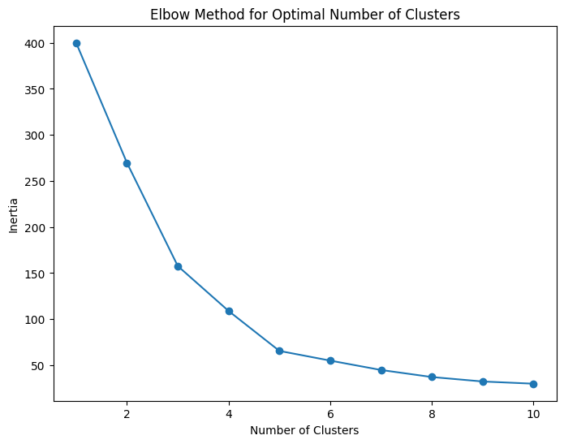
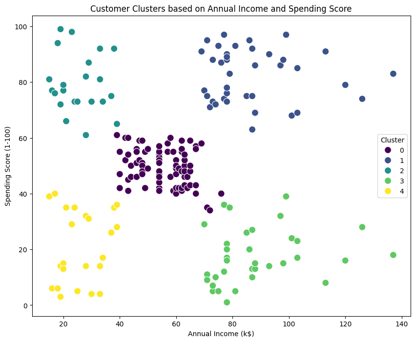
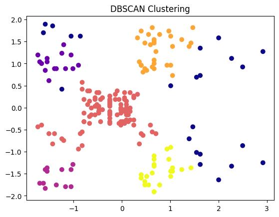

# Mall Customer Segmentation Analysis

This project performs customer segmentation analysis on the Mall Customers dataset using two clustering algorithms: **K-Means** and **DBSCAN**. The goal is to identify distinct customer groups based on their annual income and spending habits for targeted marketing strategies.

## 📊 Dataset

The `Mall_Customers.csv` dataset contains information about 200 mall customers with the following features:
- **CustomerID**: Unique identifier for each customer
- **Gender**: Customer's gender (Male/Female)
- **Age**: Customer's age
- **Annual Income (k$)**: Annual income in thousands of dollars
- **Spending Score (1-100)**: Score assigned by the mall based on customer behaviour and spending nature

## 🧮 Methodology

1.  **Data Preprocessing**: Handled categorical data and removed irrelevant features.
2.  **Exploratory Data Analysis (EDA)**: Visualized distributions of numeric features.
3.  **Feature Scaling**: Standardised features using `StandardScaler`.
4.  **Clustering**:
    - **K-Means**: Applied the Elbow Method to find the optimal number of clusters (k=5).
    - **DBSCAN**: Used parameters `eps=0.38` and `min_samples=7`.
5.  **Evaluation**: Compared both models using the **Silhouette Score**.
6.  **Analysis**: Interpreted the characteristics of each discovered customer segment.

**The dataset** `Mall_Customers.csv` is in the correct path. The notebook expects it in the same directory. You can download it from [Kaggle](https://www.kaggle.com/datasets/vjchoudhary7/customer-segmentation-tutorial-in-python).

## 📈 Results

### 🔍 Elbow Method for Optimal Number of Clusters

The Elbow Method was used to determine the optimal number of clusters for K-Means. The plot shows inertia decreasing sharply up to **k=5**, after which the decrease levels off — indicating that **5 clusters** is the best choice.

> 💡 *Inertia drops significantly from 1 to 5 clusters, then plateaus — confirming k=5 as the "elbow point".*

### K-Means Clustering (Silhouette Score: 0.554)
The algorithm identified 5 distinct customer segments:

| Cluster | Annual Income (k$) | Spending Score | Interpretation |
|:-------:|:------------------:|:--------------:|----------------|
| 0 | 55.3 | 49.5 | Moderate income, moderate spending (Standard Customers) |
| 1 | 86.5 | 82.1 | **High income, high spending (Target Customers)** |
| 2 | 25.7 | 79.4 | Low income, high spending (Budget-Conscious) |
| 3 | 88.2 | 17.1 | High income, low spending (Savvy Shoppers) |
| 4 | 26.3 | 20.9 | Low income, low spending (Price-Sensitive) |

### DBSCAN Clustering (Silhouette Score: 0.421)
*Note: Silhouette score calculated excluding noise points (Cluster -1) to evaluate only meaningful clusters.*  
DBSCAN identified 5 meaningful clusters plus outliers (labeled as -1):

| Cluster | Annual Income (k$) | Spending Score | Interpretation |
|:-------:|:------------------:|:--------------:|----------------|
| -1      | 89.0               | 58.8           | **Noise / Outliers** (atypical behavior) |
| 0       | 24.5               | 76.3           | Low income, high spending (**Impulse Buyers**) |
| 1       | 24.6               | 9.6            | Low income, low spending (**Price-Sensitive**) |
| 2       | 52.6               | 47.3           | Medium income, medium spending (**Average Shoppers**) |
| 3       | 80.2               | 83.6           | High income, high spending (**Target Customers**) |
| 4       | 81.0               | 12.8           | High income, low spending (**Savvy Savers**) |

## ✅ Conclusion

- **K-Means** performed slightly better for this specific dataset, achieving a higher silhouette score and producing well-defined, interpretable clusters.
- K-Means’ spherical assumptions matched the data structure well; DBSCAN excelled at identifying noise but yielded less distinct groupings due to density variation.
- These insights empower marketing teams to design **personalized campaigns**, **loyalty programs**, and **product recommendations** tailored to each segment’s behavior and economic profile.
- The “Savvy Savers” (high income, low spending) are especially intriguing — they represent an untapped opportunity for retention strategies.
